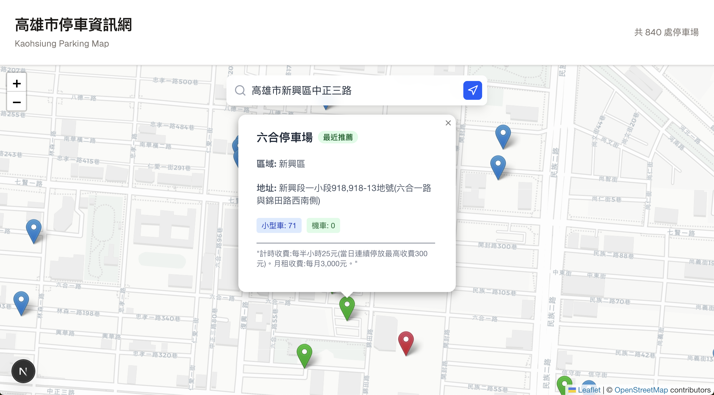

這是一個用 [`create-next-app`](https://nextjs.org/docs/app/api-reference/cli/create-next-app) 啟動的 [Next.js](https://nextjs.org) 專案。

## 開始使用

首先，執行開發伺服器：

```bash
npm run dev
# 或
yarn dev
# 或
pnpm dev
# 或
bun dev
```

在您的瀏覽器中開啟 [http://localhost:3000](http://localhost:3000) 來查看結果。

您可以透過修改 `app/page.tsx` 來開始編輯頁面。當您編輯檔案時，頁面會自動更新。

這個專案使用 [`next/font`](https://nextjs.org/docs/app/building-your-application/optimizing/fonts) 來自動優化和載入 [Geist](https://vercel.com/font)，這是 Vercel 的新字體系列。

## 了解更多

要了解更多關於 Next.js 的資訊，請參考以下資源：

- [Next.js 文件](https://nextjs.org/docs) - 了解 Next.js 的功能和 API。
- [學習 Next.js](https://nextjs.org/learn) - 一個互動式的 Next.js 教學。

您可以查看 [Next.js 的 GitHub 儲存庫](https://github.com/vercel/next.js) - 歡迎您的回饋和貢獻！

## 在 Vercel 上部署

部署您的 Next.js 應用程式最簡單的方法是使用由 Next.js 的建立者提供的 [Vercel 平台](https://vercel.com/new?utm_medium=default-template&filter=next.js&utm_source=create-next-app&utm_campaign=create-next-app-readme)。

請查看我們的 [Next.js 部署文件](https://nextjs.org/docs/app/building-your-application/deploying) 以獲取更多詳細資訊。


